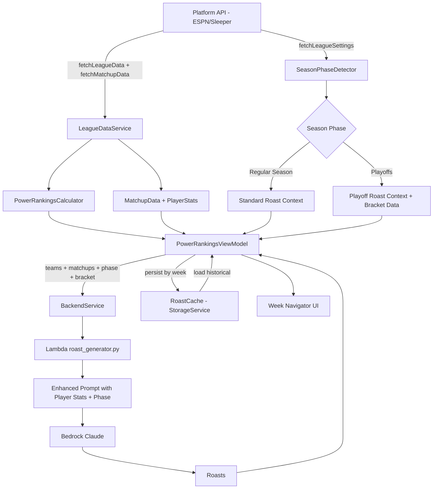

# Design Document: Roast Enhancements

## Overview

This design covers three interrelated enhancements to the Skidmark roast system: week-by-week roast history with navigation, richer player-specific roast prompts driven by matchup data, and playoff-aware roasts that adapt tone and content for postseason weeks. The changes span the iOS client (Swift/SwiftUI), the data services (ESPN and Sleeper), the local storage layer, and the backend Lambda (Python) that builds the AI prompt.

The core architectural approach is to extend the existing data pipeline rather than replace it. Matchup and player stat data flows from the platform APIs through new service methods, gets modeled alongside the existing `Team` and `Player` types, persists in the on-device cache keyed by week, and ultimately enriches the JSON payload sent to the roast generator Lambda. The Lambda prompt is restructured to incorporate per-week matchup context and a season-phase flag that toggles between regular-season and playoff roast styles.

## Architecture

The current data flow is: Platform API → LeagueDataService → PowerRankingsCalculator → PowerRankingsViewModel → BackendService → Lambda → Roasts displayed in UI.

The enhanced flow adds a week dimension and matchup layer:



## Components and Interfaces

### New Data Models

**WeeklyMatchup** -- represents a single head-to-head matchup for a given week.

```swift
struct WeeklyMatchup: Codable, Hashable {
    let weekNumber: Int
    let homeTeamId: String
    let awayTeamId: String
    let homeScore: Double
    let awayScore: Double
    let homePlayers: [WeeklyPlayerStats]
    let awayPlayers: [WeeklyPlayerStats]
}
```

**WeeklyPlayerStats** -- individual player performance for a specific week.

```swift
struct WeeklyPlayerStats: Codable, Hashable {
    let playerId: String
    let name: String
    let position: String
    let points: Double
    let isStarter: Bool
}
```

**SeasonPhase** -- enum classifying the current point in the season.

```swift
enum SeasonPhase: String, Codable {
    case regularSeason
    case playoffs
}
```

**PlayoffBracketEntry** -- a team's position in the playoff bracket.

```swift
struct PlayoffBracketEntry: Codable, Hashable {
    let teamId: String
    let seed: Int
    let currentRound: Int
    let opponentTeamId: String?
    let isEliminated: Bool
    let isConsolation: Bool
    let isChampionship: Bool
}
```

**WeeklyRoastCache** -- the on-device storage structure for a week's roasts.

```swift
struct WeeklyRoastCache: Codable {
    let leagueId: String
    let weekNumber: Int
    let generatedAt: Date
    let roasts: [String: String]  // teamId -> roast text
}
```

### Extended Protocols and Services

**LeagueDataService** gets two new methods:

```swift
protocol LeagueDataService {
    // existing
    func fetchLeagueData(leagueId: String, season: Int) async throws -> [Team]
    // new
    func fetchMatchupData(leagueId: String, season: Int, week: Int) async throws -> [WeeklyMatchup]
    func fetchLeagueSettings(leagueId: String, season: Int) async throws -> LeagueSettings
}
```

**LeagueSettings** -- extracted from the league's configuration endpoint.

```swift
struct LeagueSettings: Codable {
    let playoffStartWeek: Int
    let playoffTeamCount: Int
    let currentWeek: Int
    let totalRegularSeasonWeeks: Int
}
```

**StorageService** gets roast cache methods:

```swift
protocol StorageService {
    // existing methods...
    
    // new roast cache methods
    func saveWeeklyRoasts(_ cache: WeeklyRoastCache) throws
    func loadWeeklyRoasts(forLeagueId: String, week: Int) throws -> WeeklyRoastCache?
    func deleteAllRoasts(forLeagueId: String) throws
    func availableRoastWeeks(forLeagueId: String) throws -> [Int]
}
```

**BackendService** gets an enhanced signature:

```swift
protocol BackendService {
    // existing
    func generateRoasts(teams: [Team], context: LeagueContext) async throws -> [String: String]
    // new -- includes matchup data, season phase, and optional bracket
    func generateRoasts(
        teams: [Team],
        context: LeagueContext,
        matchups: [WeeklyMatchup],
        weekNumber: Int,
        seasonPhase: SeasonPhase,
        playoffBracket: [PlayoffBracketEntry]?
    ) async throws -> [String: String]
}
```

### SeasonPhaseDetector

A utility that determines the season phase from league settings:

```swift
enum SeasonPhaseDetector {
    static func detect(currentWeek: Int, playoffStartWeek: Int) -> SeasonPhase {
        currentWeek >= playoffStartWeek ? .playoffs : .regularSeason
    }
}
```

### PowerRankingsViewModel Changes

The view model gains week-navigation state and matchup awareness:

- `selectedWeek: Int` -- the week currently being viewed
- `availableWeeks: [Int]` -- weeks that have cached roasts
- `currentWeek: Int` -- the latest week from league settings
- `seasonPhase: SeasonPhase` -- regular season or playoffs
- `weeklyMatchups: [WeeklyMatchup]` -- matchups for the selected week
- `playoffBracket: [PlayoffBracketEntry]?` -- bracket data when in playoffs
- `navigateToWeek(_ week: Int)` -- loads cached roasts or fetches fresh data for the target week
- `generateRoastsForWeek()` -- calls the enhanced backend endpoint with matchup + phase data

### Week Navigator UI

The `PowerRankingsView` gets a week selector bar inserted above the team list. The bar shows the current week number with left/right chevron buttons. Tapping left decrements the week (minimum 1), tapping right increments (maximum currentWeek). The bar also shows a label like "Week 8" or "Week 14 -- Playoffs" when in postseason.

### Backend Lambda Changes

The `roast_generator.py` Lambda receives an expanded request body:

```json
{
    "teams": [...],
    "context": {...},
    "week_number": 8,
    "matchups": [
        {
            "home_team_id": "1",
            "away_team_id": "5",
            "home_score": 112.4,
            "away_score": 98.7,
            "home_players": [
                {"name": "Patrick Mahomes", "position": "QB", "points": 28.4, "is_starter": true}
            ],
            "away_players": [...]
        }
    ],
    "season_phase": "regular_season",
    "playoff_bracket": null
}
```

The `_build_prompt` function is restructured to:

1. Include a "THIS WEEK'S MATCHUPS" section listing each head-to-head result with scores.
2. Under each team block, list all starters with their point totals, highlighting the top scorer and biggest bust.
3. When `season_phase` is `"playoffs"`, swap the roasting approach section to emphasize elimination, bracket position, seeds, and championship stakes.
4. When `playoff_bracket` is provided, include a "PLAYOFF BRACKET" section showing seeds, matchups, and elimination status.
5. Fall back to the existing prompt structure when matchup data is absent (backward compatibility).

## Data Models

The data models are defined in the Components section above. The key relationships are:

- A `WeeklyMatchup` pairs two team IDs with their scores and full player stat lines for that week.
- `WeeklyPlayerStats` is a simpler, week-specific version of the existing `Player` model, adding an `isStarter` flag.
- `PlayoffBracketEntry` is a flat representation of a team's bracket position, avoiding nested tree structures for simplicity.
- `WeeklyRoastCache` wraps a week's worth of roasts with metadata for storage and retrieval.
- `LeagueSettings` captures the league configuration needed for season phase detection and week bounds.
- `SeasonPhase` is a simple enum used as a discriminator throughout the pipeline.

The existing `Team`, `Player`, `LeagueContext`, and `LeagueConnection` models remain unchanged. The new models are additive and do not break existing serialization or caching.


## Correctness Properties

*A property is a characteristic or behavior that should hold true across all valid executions of a system -- essentially, a formal statement about what the system should do. Properties serve as the bridge between human-readable specifications and machine-verifiable correctness guarantees.*

### Property 1: Roast cache round-trip

*For any* valid `WeeklyRoastCache` (with arbitrary league ID, week number, timestamp, and roast dictionary), saving it via `saveWeeklyRoasts` and then loading it via `loadWeeklyRoasts` with the same league ID and week number should return an equivalent object with identical week number, timestamp, and roasts dictionary.

**Validates: Requirements 1.1, 1.2**

### Property 2: Roast cache overwrite

*For any* league ID and week number, if two distinct `WeeklyRoastCache` objects are saved sequentially for the same league and week, loading should return only the second (most recently saved) cache entry.

**Validates: Requirements 1.3**

### Property 3: Roast cache deletion

*For any* league ID with roasts stored across an arbitrary set of week numbers, calling `deleteAllRoasts(forLeagueId:)` should result in `loadWeeklyRoasts` returning nil for every previously stored week.

**Validates: Requirements 1.4**

### Property 4: Week navigation bounds

*For any* current week value C (where C >= 1) and any selected week S (where 1 <= S <= C), navigating backward from S should produce max(1, S-1) and navigating forward should produce min(C, S+1). Navigation backward is disabled when S == 1, and navigation forward is disabled when S == C.

**Validates: Requirements 2.3, 2.4, 2.5, 2.6**

### Property 5: Cache load on week navigation

*For any* league with roasts cached for a set of weeks W, navigating to a week w in W should surface the roasts that were previously stored for that week (matching the round-trip from Property 1).

**Validates: Requirements 2.7**

### Property 6: ESPN matchup parsing produces valid structures

*For any* valid ESPN matchup JSON response containing team pairings and roster data, parsing should produce `WeeklyMatchup` objects where both team IDs are non-empty, scores are non-negative, and each player stats entry has a non-empty name, a valid position string, and a numeric points value.

**Validates: Requirements 3.1, 3.3**

### Property 7: Sleeper matchup parsing produces valid structures

*For any* valid Sleeper matchup JSON response, parsing should produce `WeeklyMatchup` objects with the same structural invariants as Property 6: non-empty team IDs, non-negative scores, and valid player stats entries.

**Validates: Requirements 3.2, 3.4**

### Property 8: Enhanced request serialization includes all fields

*For any* roast generation request containing teams, context, matchups, week number, season phase, and an optional playoff bracket, the JSON-serialized request body should contain keys for `matchups`, `week_number`, `season_phase`, and (when bracket is non-nil) `playoff_bracket`.

**Validates: Requirements 3.5, 5.5, 7.4**

### Property 9: Prompt includes matchup and player data

*For any* non-empty list of `WeeklyMatchup` objects with at least one starter per team, the built prompt string should contain: each team's weekly score, each team's opponent name, every starter's name and point total, the name of the top-scoring player per team, and the name of the lowest-scoring starter per team.

**Validates: Requirements 4.1, 4.2, 4.3**

### Property 10: Empty matchups fall back to legacy prompt

*For any* set of teams and context with an empty matchups list, the built prompt should not contain a "THIS WEEK'S MATCHUPS" section and should match the structure of the existing season-aggregate prompt format.

**Validates: Requirements 4.6**

### Property 11: ESPN league settings parsing

*For any* valid ESPN league settings JSON containing playoff configuration fields, parsing should produce a `LeagueSettings` with `playoffStartWeek` > 0, `playoffTeamCount` > 0, and `currentWeek` >= 1.

**Validates: Requirements 5.1**

### Property 12: Sleeper league settings parsing

*For any* valid Sleeper league settings JSON containing playoff configuration fields, parsing should produce a `LeagueSettings` with the same invariants as Property 11.

**Validates: Requirements 5.2**

### Property 13: Season phase detection

*For any* pair of integers (currentWeek, playoffStartWeek) where both are >= 1, `SeasonPhaseDetector.detect` should return `.regularSeason` if and only if currentWeek < playoffStartWeek, and `.playoffs` otherwise.

**Validates: Requirements 5.3, 5.4**

### Property 14: Prompt content is phase-appropriate

*For any* roast prompt built with a `SeasonPhase` value, when the phase is `.playoffs` the prompt should contain playoff-specific language (e.g., "elimination", "bracket", "playoff"), and when the phase is `.regularSeason` the prompt should not contain those playoff-specific terms.

**Validates: Requirements 6.1, 6.6**

### Property 15: Playoff bracket data appears in prompt

*For any* non-empty list of `PlayoffBracketEntry` objects included in a playoff-phase prompt build, the prompt should: contain each team's seed number, reference eliminated teams' consolation status, mention head-to-head playoff pairings by both team names, and include championship-specific language for entries where `isChampionship` is true.

**Validates: Requirements 6.2, 6.3, 6.4, 6.5**

### Property 16: ESPN bracket parsing

*For any* valid ESPN playoff bracket JSON response, parsing should produce `PlayoffBracketEntry` objects where each entry has a non-empty team ID, a seed >= 1, a current round >= 1, and consistent boolean flags (a team cannot be both eliminated and in the championship).

**Validates: Requirements 7.1**

### Property 17: Sleeper bracket parsing

*For any* valid Sleeper playoff bracket JSON response, parsing should produce `PlayoffBracketEntry` objects with the same structural invariants as Property 16.

**Validates: Requirements 7.2**

### Property 18: Playoff bracket fallback

*For any* roast prompt built with `SeasonPhase.playoffs` but a nil or empty playoff bracket, the prompt should fall back to the regular-season format and should not contain bracket-specific sections (seeds, elimination references).

**Validates: Requirements 7.5**

## Error Handling

Errors in this enhancement fall into three categories: storage failures, network/API failures, and data-unavailability fallbacks.

For storage failures (roast cache read/write), the system follows the existing pattern in `StorageService`: encode/decode errors are thrown as `StorageError` and surfaced in the view model's `errorMessage`. Cache load failures are non-fatal -- the view model silently falls back to showing no roasts for that week, matching the existing `loadCachedData` behavior.

For network failures when fetching matchup data or league settings, the existing `RetryableService` retry policy applies. If matchup data cannot be fetched after retries, the system falls back to the legacy prompt format (Requirement 4.6). If league settings cannot be fetched, the system defaults to regular-season phase, avoiding incorrect playoff assumptions.

For playoff bracket data unavailability (Requirement 7.5), the Lambda prompt builder checks for a nil or empty bracket and falls back to the regular-season prompt format. This ensures roasts are always generated even when bracket data is incomplete or the platform API doesn't expose it.

The Lambda itself continues to return 400 for missing teams, 500 for generation failures, and the iOS client maps these to user-facing error messages via the existing `formatErrorMessage` method in `PowerRankingsViewModel`.

## Testing Strategy

Testing uses a dual approach: unit tests for specific examples and edge cases, and property-based tests for universal correctness properties.

**Unit tests** cover:
- Specific ESPN and Sleeper JSON fixtures for matchup parsing (known good/bad payloads)
- Edge cases: week 1 navigation boundary, empty rosters, leagues with no playoff configuration
- Error conditions: malformed JSON, missing fields, network timeouts
- Integration points: view model correctly wires week navigation to cache loads

**Property-based tests** cover the 18 properties defined above. Each property test generates random valid inputs and verifies the stated invariant holds across at least 100 iterations.

The Swift property tests use the `swift-testing` framework with a custom property-testing helper or the `SwiftCheck` library. The Python property tests for the Lambda prompt builder use `hypothesis`.

Each property test is tagged with a comment referencing its design property:
```
// Feature: roast-enhancements, Property 1: Roast cache round-trip
// Validates: Requirements 1.1, 1.2
```

For the Python Lambda tests:
```python
# Feature: roast-enhancements, Property 9: Prompt includes matchup and player data
# Validates: Requirements 4.1, 4.2, 4.3
```

Property tests focus on the pure logic layers (cache operations, prompt building, season phase detection, data parsing/serialization) where random input generation is straightforward. Unit tests handle the integration seams (view model orchestration, network mocking, UI state transitions) where specific scenarios are more valuable than random exploration.
